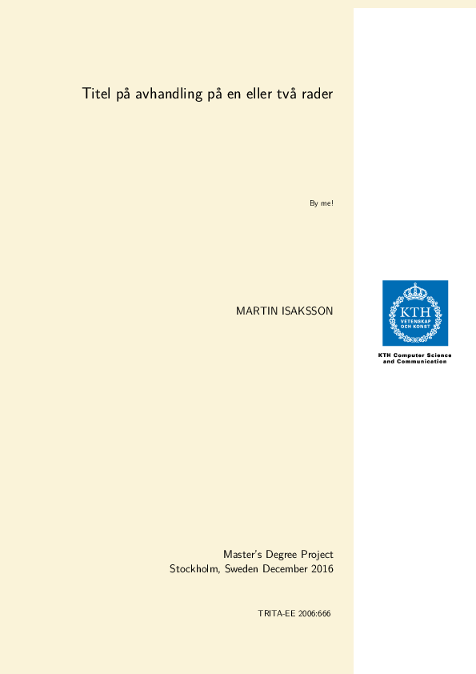
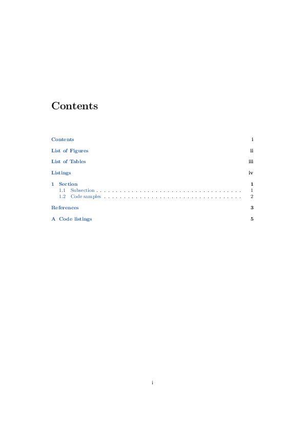
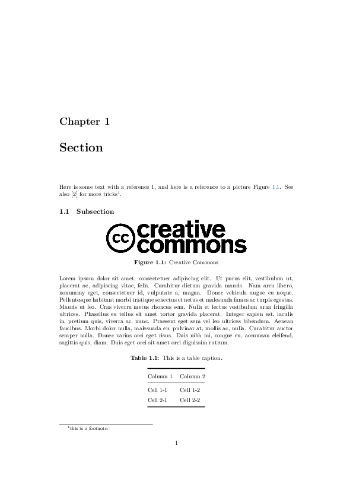
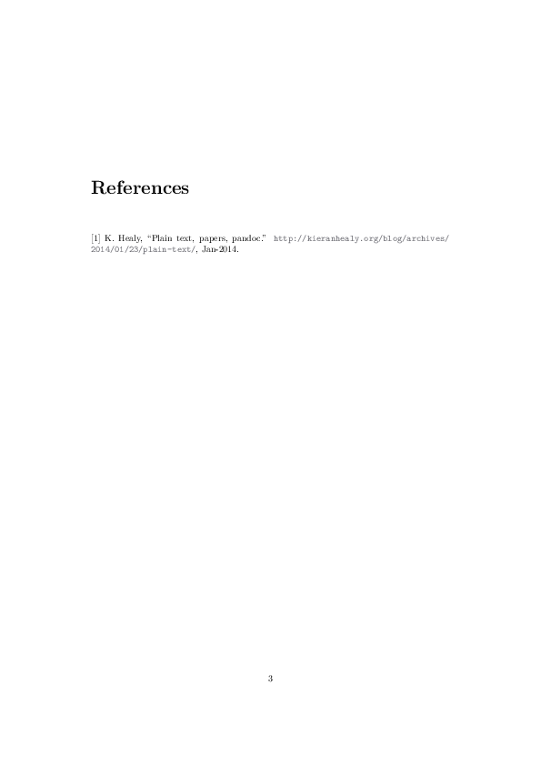
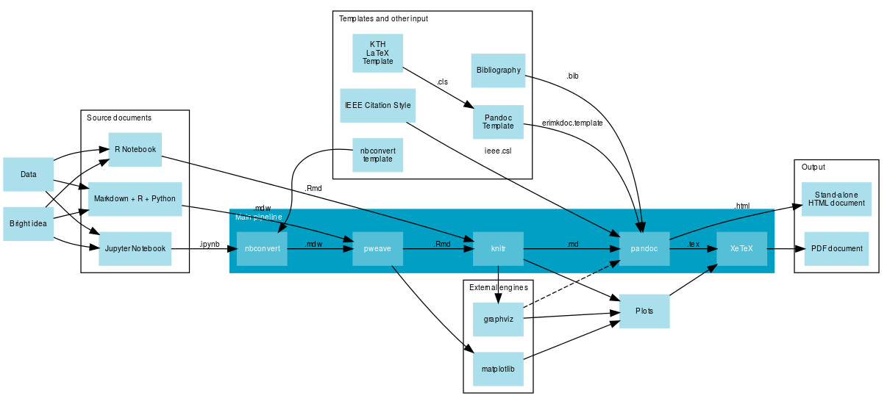

# Introduction

 

This is a template based on the [KTH NADA templates](http://system.csc.kth.se/misc/tex/) but modified to allow you to write in [Markdown](https://en.wikipedia.org/wiki/Markdown).

## The pipeline

Here's the full pipeline, although most of this is not implemented in the examples yet.

# Installation Instructions

Tested on Ubuntu.

## LaTeX and Pandoc

You will need a LaTeX compiler such as [XeLaTeX](http://xetex.sourceforge.net/) and [Pandoc](http://pandoc.org/). Here we use `cabal` and not the Ubuntu packages in order to be able to use `pandoc-citeproc` and `pandoc-crossref`. Lastly we install `pandoc-eqnos` using `pip`. You might want to do this last step in a `virtualenv`.

~~~~
sudo apt update
sudo apt install texlive-full haskell-platform
cabal update
cabal install pandoc pandoc-citeproc pandoc-crossref
sudo pip install pandoc-eqnos
~~~~

## Templates and packages

Install these the normal way. See [LaTeX och TeX på NADA](http://system.csc.kth.se/misc/tex/) for more information.

* [KTH Thesis Template](ftp://ftp.nada.kth.se/pub/tex/local/kthesis.tar.gz)
* [KTH Symbol](ftp://ftp.nada.kth.se/pub/tex/local/kthsym.tar.gz)
* [KTH Colorscheme for LaTeX](https://github.com/KTH-AC/kthcolors)
* [Titlepage](https://svn.kwarc.info/repos/arXMLiv/trunk/sty/KTHEEtitlepage.sty)

# Running instructions

First you will need to edit `Makefile` to make sure all the paths are correct, then you should be able to compile the example with `make`.

## Minimal example

We start off with a [YAML ](http://yaml.org/) header.

~~~~
---
title: Titel på avhandling på en eller två rader
subtitle: By me!
author: Martin Isaksson
date:  December 2016
---
~~~~

Then we add the body.

~~~~
# Section

Here is some general text with a reference @Plain21:online.

## Subsection

Let's add a picture. Sad part is that we can't use a short caption.

{#mylabel}

\lipsum
~~~~

And lastly we add an empty `References` section which will be filled in by Pandoc.

~~~~
# References
~~~~

## More information

* [pandoc-crossref](https://github.com/lierdakil/pandoc-crossref)
* [Markdown Cheatsheet](https://github.com/adam-p/markdown-here/wiki/Markdown-Cheatsheet)

## Contributing

I encourage you to help me out with this project. Please fork and submit pull requests. Thank you!
